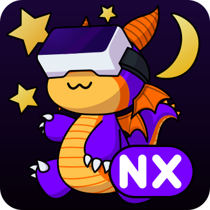

<h1 align="center"> WiVRn NX </h1>
<p align="center"><b>A hot-rodded fork of <a href="https://github.com/WiVRn/WiVRn">WiVRn</a>: self-healing streaming, adaptive everything, OLED-violet everything else.</b></p>

WiVRn NX is a fork of WiVRn (master, `nx-patches` branch) focused on making the stream
survive the real world — flaky Wi-Fi, slow games, sleeping controllers — and on looking good
while doing it. Every feature that affects what the headset experiences has a toggle in the
headset settings UI. The NX client and NX server must be used together (several features add
protocol fields; mismatched pairings are refused cleanly at handshake as an incompatible
version), and both must be built from the same tree.

Primary target and test hardware: **Pico 4** (regular, XR2 Gen 1: H.264 + HEVC decode, no AV1)
with Pico Motion Trackers, on Linux. Everything except the Pico-specific fixes applies to any
headset WiVRn supports.

## Fixes over upstream

| | |
|---|---|
| **Controller standby teleport** | Upstream discards the OpenXR *tracked* flags server-side (the old `TODO keep the tracked flag` in `pose_list.cpp`), so a Pico controller entering its non-disableable auto-sleep jumps to a garbage pose in-game. NX freezes the device at its last tracked pose — reported valid, TRACKED cleared, velocities zeroed. Devices whose runtime never sets tracked bits (estimated body joints) keep upstream behaviour exactly, so full body tracking is unaffected. |
| **Transport robustness** | A malformed, short, or oversized datagram is dropped and counted instead of tearing the session down; oversized datagrams are detected (`MSG_TRUNC`) instead of being silently truncated; a stalled TCP write can no longer block UDP video (per-socket bounded send queues). |
| **Honest labels** | The upstream "Application SpaceWarp" setting performs no frame synthesis — it only halves the stream rate. NX names it "Half framerate mode" and describes what it does. |

## Adaptive streaming

- **Automatic bitrate** — the server measures, from the per-frame feedback the headset already
  sends, how much of each frame period was spent receiving that frame, plus frames that never
  arrived, and adapts the bitrate itself. Gradual signal decay gets a gentle decrease with slow
  probing back up; an acute lag spike gets a deep drop (which drains whatever queue wedged)
  followed by a fast slow-start rebound to the pre-drop level, with ssthresh-style backoff.
  The bitrate set on the headset is always the ceiling. Toggles: headset (*Automatic bitrate*)
  and dashboard; config key `bitrate-auto` (`min-bitrate` floor, default 10 Mbit/s).
- **Radio-aware bitrate** *(toggle, default on)* — frame timings are a *lagging* indicator: by
  the time the utilisation rises the packets are already late. The headset reports its Wi-Fi
  RSSI and PHY rate once a second, and the server steps the bitrate down **before** the loss
  when the signal has been falling for a few seconds (or when rate adaptation has already
  halved the PHY rate out from under the stream) — walking away from the router now costs a
  bitrate step instead of a lag spike. Only the *trend* is used, never absolute dBm, which
  means nothing across houses and headsets. It can only ever lower the bitrate, it stands down
  while the deep-drop rebound is in charge, and reports older than five seconds are ignored
  entirely. Needs *Automatic bitrate*; no server configuration, the thresholds are constants.
- **Smooth packet pacing** *(toggle, default on)* — a frame used to be drained into the socket as
  fast as the kernel would take it: a few hundred kilobytes hitting the access point every 11 ms,
  which is exactly what overflows its buffer and produces the lag-then-recover wedge the deep drop
  above exists to clean up after. NX spreads each frame over 40% of a frame period instead, in
  12 kB micro-bursts on absolute deadlines, sharing one window between all the video streams. It
  never delays the control socket (IDRs and their parameter sets), never runs while the USB path
  carries video, and gives the window back when the encoder delivers late. Config key `pacing`
  (`window`, default 0.4).
- **Error correction (FEC)** *(toggle, default on)* — a single dropped datagram used to cost the
  whole frame *and* the keyframe round trip that followed it, which is why one lost packet shows
  up as a visible hitch rather than a smudge. NX sends a parity shard after every group of 8
  video shards; the headset XORs the group back together and rebuilds the missing one, in time
  for the frame it belongs to. The parity covers the shard's pose and timing information as well
  as its picture data, so the first and last shards of a frame — the two without which a frame
  cannot be submitted at all — recover like any other, and the parity shard is what tells the
  headset a lost *last* shard existed in the first place. Each group's parity goes out with its
  own micro-burst rather than in one tail burst, so a hiccup cannot swallow a whole frame's
  protection. Costs ~12%, which is taken *out of* the encoder bitrate rather than added on top:
  the total on the wire stays exactly where the bitrate controller put it, and a rebuilt frame is
  never counted as lost. XOR recovers one loss per group, which is the common case; a burst-
  tolerant code over the same groups is a v2 item. No server configuration.
- **Wi-Fi QoS priority** *(toggle, default on)* — both ends mark their sockets with a DSCP class,
  which access points map to the WMM access categories: the server's video stream gets AF41 (AC_VI),
  every socket carrying control, tracking, inputs and feedback gets EF (AC_VO), so a tracking packet
  is never stuck behind a 200 kB frame in the same hardware queue. IPv6 sockets are marked through
  `IPV6_TCLASS` as well as `IP_TOS`, since a v4-mapped peer takes the mark from the latter. A few
  networks mangle or drop marked traffic, hence the toggle; the marks are applied and cleared live.
- **Low-latency audio path** *(toggle, default on)* — audio used to share the control socket with
  tracking, settings and everything else, so one dropped packet stalled *every* later audio packet
  behind it while TCP resent it: the crackle-then-catch-up that follows a Wi-Fi hiccup is head-of-
  line blocking, not a buffer that ran dry. NX puts both directions (PC speaker and headset
  microphone) on the same loss-tolerant path the video rides — whatever the path selector currently
  routes, never duplicated across paths — with a wrapping sequence number per packet. The receiver
  plays what is in order byte for byte, drops what is late or repeated, and *conceals* what is
  missing: the last packet repeated under a linear fade to silence over 60 ms, the next real packet
  ramped back up over 5 ms, and plain silence past that, because a gap that long is a real outage
  and not a glitch to paper over. A lost datagram costs a concealed 5 ms instead of a stutter.
  Packets stay under 1200 B of PCM (a 5 ms stereo quantum is 960 B; a longer capture buffer is cut
  on frame boundaries), so audio never fragments. Off restores upstream behaviour exactly, control
  socket and all — the packet says which path it came from, so either end may be flipped mid-session.
  No server configuration.
- **Motion smoothing** *(toggle, default off)* — when the game runs far below the display rate
  (a CPU-bound VRChat instance at 10 fps), the server computes a coarse motion field between
  real application frames (a compositor compute pass — works with **every** encoder, unlike
  encoder-MV approaches) and the headset warps the last frame along t-scaled vectors on the
  refreshes the game produced nothing for. Rotation was already smooth; this smooths position,
  animation and hands too. Frames are never dropped or held to a fixed cadence in the first
  place — NX free-runs the app and takes every real frame it can produce.

## Multipath: USB backup with seamless failover

Plug a USB-C cable into the headset at any point during a session and a **second network path
attaches automatically** (the dashboard keeps an `adb reverse` tunnel armed; the headset probes
it every 5 s). Tracking and battery are duplicated across both paths immediately. If the Wi-Fi
path then dies — silence for 400 ms, or hard send errors — video and control **flip to the
cable in under half a second** with a forced IDR, the bitrate controller gets a USB ceiling
(`multipath.usb-max-bitrate`, default 100 Mbit/s), and the clock estimator resets. When Wi-Fi
is healthy again for 5 s, everything flips back. Each secondary path gets its own encryption
keys. Toggles: headset (*USB backup connection*), dashboard (*USB backup tunnel*). Both ends
log every attach/flip with reasons and RTT.

## Image quality and comfort

- **Contrast-adaptive sharpening** *(toggle + strength slider, default off)* — AMD CAS folded
  into the existing defoveation pass, restoring the edge contrast the video codec removes.
  The single biggest lever for small-text legibility.
- **Text clarity mode** *(toggle, default off)* — biases the encoders for fine-detail
  retention (deblocking offsets, adaptive quantization, DCT decimation off where each API
  allows). Takes effect on the next connection.
- **Comfort vignette** *(toggle, default on)* — a soft peripheral fade that eases in when the
  app framerate craters and lifts when it recovers; peripheral judder is what triggers nausea.
- **Sharp overlay layers** *(in development)* — OpenXR quad layers (wlx-overlay-s / WayVR
  panels) promoted out of the lossy world video into their own stream, composited on the
  headset with 90 Hz pose stability.

## Desktop mirror

The server can publish the headset view (left eye, post-composition, pre-foveation — the clean
undistorted image) as a PipeWire video source node named **WiVRn Headset View**: watch or
record with OBS ("PipeWire Camera" source), `gst-launch-1.0 pipewiresrc
target-object=wivrn-headset-view ! videoconvert ! autovideosink`, or any PipeWire client.
Config key `mirror` (`enabled`, `fps` default 30, `scale` default 0.5); off by default; zero
cost while no consumer is attached.

## The NX look

True-black OLED theme with a `#7700FF` accent by default, a space lobby (emissive starfield,
violet nebulae, a ringed gas giant, a grid deck), an NX-badged night-sky icon — and a distinct
identity everywhere: application ID `org.meumeu.wivrn.nx`, app name "WiVRn NX", desktop entry
`io.github.wivrn.wivrn.nx`, so everything installs **alongside** stock WiVRn without conflict.

## Roadmap (in active development)

Reed-Solomon parity (burst-tolerant, on the same groups as the XOR above) · hardware-encoder
failover to x264 · BBR-style bitrate control v2 · an in-headset transport HUD.
Design documents live in
[docs/](docs/): [multipath](docs/multipath.md), [frame extrapolation](docs/frame-extrapolation.md),
[quad layers](docs/quad-layers.md).

## Building

Client and server must come from the same tree. Server: CMake/Ninja as upstream
([docs/building.md](docs/building.md)); the dashboard additionally wants Qt6 + KF6 + ECM.
APK: Android SDK (platform 34, build-tools 34, NDK 29.0.14206865, **the SDK's own
CMake 3.31.5** — stock Kitware CMake lacks Google's `AndroidNdkModules`), the host `ktx` tool
on the Gradle daemon's PATH, then:

```
./gradlew assembleRelease -Psuffix= -Pwivrn_version=<version>
```

Config reference: [docs/configuration.md](docs/configuration.md). Everything below this line
is the upstream documentation.

---

<div align="center">
  
[](https://www.gnu.org/licenses/gpl-3.0)  
  
</div>
<p align="center"></p>
<h3 align="center">Fully FOSS PCVR streamer</h3>

# About

WiVRn is an application that wirelessly streams a virtual reality game to a standalone VR headset from a <b>Linux</b> computer.

WiVRn support a wide range of VR devices:

| Headset | Supported | Notes |
|:--------:|:--------:|:--------:|
| Quest 1 | ✓ |  |
| Quest 2 | ✓ |  |
| Quest 3 | ✓ |  |
| Quest 3s | ✓ |  |
| Quest Pro | ✓ |  |
| Pico Neo 3 | ✓ |  |
| Pico 4 | ✓ |  |
| HTC Vive Focus 3 | ✓ | Laggy | 
| HTC Vive XR Elite | ✓ | Laggy |
| Samsung Galaxy XR | ✓ |  |
| Other Android VR | ? | Cannot know |
| Play for Dream | ✖ | https://github.com/WiVRn/WiVRn/issues/465 |
| Non-Android VR | ✖ | Not Android |
| Non-VR Android | ✖ | VR required |

<sup>A Linux client does exist, only for debugging. It has no audio or hardware decoding.</sup>

# Getting started


## PC Server/Dashboard

We recommend using native packages if available for your distribution:
- [Arch User Repository](https://aur.archlinux.org/packages/wivrn-dashboard)
- [Fedora](https://packages.fedoraproject.org/pkgs/wivrn/wivrn/)
- [Gentoo Guru](https://gitweb.gentoo.org/repo/proj/guru.git/tree/media-libs/wivrn)
- [NixOS](https://search.nixos.org/packages?show=wivrn)

For OpenVR and Steam compatibility, you also need a compatibility library such as [xrizer](https://github.com/Supreeeme/xrizer/) or [OpenComposite](https://gitlab.com/znixian/OpenOVR/).

A Flatpak is available on Flathub for all distributions:

[](https://flathub.org/apps/io.github.wivrn.wivrn)

The Flatpak contains both xrizer and OpenComposite.

Note that due to Flatpak sandboxing, some features such as support for SteamVR tracked (Lighthouse) devices, or virtual gamepad/keyboard/input devices forwarded from the headset, may not be available.

## Headset Client/App

Follow the wizard in the PC dashboard to install the client on your VR headset.

It should either lead you to the [Meta Store](https://www.meta.com/experiences/7959676140827574/) (for Meta Quest headsets) or to download the correct APK (for other headsets).

> [!WARNING]
> The VR client and PC server need to be on the same version of WiVRn

> [!TIP]
> If the headset fails to connect to the computer, see [troubleshooting](#troubleshooting).


# Usage

## Running

### Prerequisites
Avahi must be running:
```bash
systemctl enable --now avahi-daemon
```

On SteamOS, the Avahi configuration needs to be modified to allow user services such as WiVRn to publish services on the network; see https://github.com/WiVRn/WiVRn/issues/1001#issuecomment-4940906113 for instructions on how to do so.

- If a firewall is installed, open port 5353/UDP for Avahi and ports 9757/UDP+TCP for WiVRn.
- For example, if using UFW run `ufw allow 5353/udp` and `ufw allow 9757`.

### Start the PC server process
The graphical frontend is listed as "WiVRn server" in the application list, and is `wivrn-dashboard` on command line. On first start, a wizard will guide you through the initial steps.

The actual server for headless usage is `wivrn-server`. When installed through your distribution's package manager, a systemd user service named `wivrn` is also installed, which can be enabled to automatically start on login with `systemctl --user enable --now wivrn`.

For Steam games, depending on the installation method, you may need to set launch options in the Steam properties for each game you want to run. Either the dashboard or command line output will display the launch command if it is required.

### Start the headset application
On the headset, when installed from the store, simply start `WiVRn`. If you installed the app via the dashboard, or manually via `adb`, it will be in an "unknown sources" section.

On first start, it will ask if you want to enable some features such as microphone, hand tracking, eye tracking, etc., as they will require permissions to be granted. It is possible to grant those later from the Settings tab.

It is highly recommended to use default settings and only tweak them if you experience issues.

### Connect to the server
The headset application will start on a server list. Your computer should be visible and have a connect button. Simply click it to start streaming.

When the headset is connected, wivrn-server sets the OpenXR and OpenVR configuration to use WiVRn. Thus, applications will only be able to run in VR once the headset connection is established. The configuration is reverted once the connection ends and all running VR applications are closed. 

The headset connection also triggers the creation of a virtual speaker and, if enabled in the headset app settings, a microphone. You will have to set them as the default output and input devices in your system audio configuration. This setting persists to future sessions until you change the defaults to other devices.

### Start an application
When the headset is connected and no XR application is running, it will show an application launcher. Applications in that list are sourced from:
- Steam games that are flagged as VR. Steam may need to be restarted for the list to be updated when new games are installed.
- .desktop files that contain `X-WiVRn-VR` in the `Categories` section. Files are searched in [standard locations](https://specifications.freedesktop.org/desktop-entry/latest/file-naming.html#desktop-file-id) which usually include `~/.local/share/applications` and `/usr/share/applications/`.

You can set an application to be started automatically when your headset is connected, in the dashboard settings or [manually](docs/configuration.md#application).

## Steam Flatpak
Flatpak applications are only able to access the Flatpak version of WiVRn.

If you're using the Steam Flatpak, you'll need to grant read only access to the following paths:

```bash
flatpak override \
  --filesystem=xdg-run/wivrn:ro \
  --filesystem=xdg-data/flatpak/app/io.github.wivrn.wivrn:ro \
  --filesystem=/var/lib/flatpak/app/io.github.wivrn.wivrn:ro \
  --filesystem=xdg-config/openxr:ro \
  --filesystem=xdg-config/openvr:ro \
  com.valvesoftware.Steam
```

When using a user installation of flatpak Steam, use `override --user` instead of `override`.

The same overrides should work for other VR applications distributed as Flatpaks.

# Building

See [building](docs/building.md) for building the [dashboard](docs/building.md#dashboard), [server (PC)](docs/building.md#server-pc), and [client (headset)](docs/building.md#client-headset)


# Configuration
Most settings are controlled through the headset app, while the server has configuration for items that are specific to the server. Use the dashboard to edit the latter, or see [configuration](docs/configuration.md) for editing it manually.

# Troubleshooting
<details><summary>My computer is not seen by the headset</summary>

If the server list is empty in the headset app:
- Make sure your computer is connected on the same network as your headset
- Check that avahi is running with `systemctl status avahi-daemon`, if it is not, enable it with `systemctl enable --now avahi-daemon`
- If you have a firewall, check that port 5353 (UDP) is open</details>

<details><summary>My headset does not connect to my computer</summary>
  
- If you have a firewall, check that port 9757 (UDP and TCP) is open
- The server and client must be the same version.</details>

<details><summary>How do I use a wired connection manually?</summary>

- Make sure the WiVRn Server is installed and running on your computer
- Make sure you have the WiVRn app installed on your headset
- After starting the "WiVRn Server" on your computer and ensuring your device is connected to your PC via cable, run the following in your terminal (Note: using `adb` on some devices may require developer mode to be enabled):
   - ```bash
      adb reverse tcp:9757 tcp:9757
      adb shell am start -a android.intent.action.VIEW -d "wivrn+tcp://localhost" org.meumeu.wivrn
      ```
   - Depending on your install type, you may need to replace `org.meumeu.wivrn` (Meta Store install) with:
      - `org.meumeu.wivrn.github` for [releases](https://github.com/WiVRn/WiVRn/releases) on Github
      - `org.meumeu.wivrn.github.nighly` for Github nightlies (wirvn-apk [repository](https://github.com/WiVRn/WiVRn-APK/releases))
      - `org.meumeu.wivrn.github.testing` for Github CI builds
      - `org.meumeu.wivrn.local` for developer builds
- You can now continue the pairing process as documented in the running section.</details>

<details><summary>How do I see server logs when using the dashboard?</summary>

- Click Troubleshoot > Open server logs, or
- Navigate to `${XDG_STATE_HOME}/wivrn/wivrn-dashboard` (with fallback to `${HOME}/.local/state` for `${XDG_STATE_HOME}`, or
- For flatpak, navigate to `${HOME}/.var/app/io.github.wivrn.wivrn/.local/state/wivrn/wivrn-dashboard`.</details>

<details><summary>My NVIDIA GPU P-State is limited to P2 instead of reaching the highest P0 while using the NVIDIA NVENC encoder</summary>
    
- See [nvenc](docs/nvenc.md) for troubleshooting.</details>

<details><summary>I have high motion latency, black borders following my view, hear corrupted audio or see a corrupted, pixelated image</summary>

- When connecting through USB, make sure the headset isn't connected through WiFi (switch off WiFi)
- Reset the settings using the button at the bottom of the settings tab
- Try switching to software encoding
- Decrease the bitrate
- Decrease the resolution in the WiVRn app
- Connect through USB or use a better WiFi router.

Note: WiVRn isn't properly optimized for NVIDIA GPUs due to the lack of developers with NVIDIA hardware. Motion latency may be significantly worse at rendering resolutions higher than default.</details>

# Community Support

We are available on either **Discord** or **Matrix space**:

[](https://discord.gg/EHAYe3tTYa) [](https://matrix.to/#/#linux-vr-adventures:matrix.org)

Please use the `wivrn` chat room for questions or issues specific to WiVRn.


# Contributing

## Translations

See [translating](docs/translating.md) for procedure.


# Credits
WiVRn uses the following software:
- [ambientCG](https://ambientcg.com/)
- [Avahi](https://www.avahi.org/)
- [Boost.Locale](https://github.com/boostorg/locale)
- [Boost.PFR](https://github.com/boostorg/pfr)
- [CLI11](https://github.com/CLIUtils/CLI11)
- [Dear ImGui](https://github.com/ocornut/imgui)
- [fastgltf](https://github.com/spnda/fastgltf)
- [ffmpeg](https://ffmpeg.org/) optional, for hardware encoding on AMD/Intel
- [FreeType](https://freetype.org/)
- [glm](http://glm.g-truc.net/)
- [HarfBuzz](https://harfbuzz.github.io/)
- [librsvg](https://wiki.gnome.org/Projects/LibRsvg)
- [Monado](https://monado.freedesktop.org/)
- [nvenc](https://developer.nvidia.com/nvidia-video-codec-sdk) optional, for hardware encoding on NVIDIA
- [qCoro](https://qcoro.dev/)
- [Qt 6](https://www.qt.io/) optional, for the dashboard
- [spdlog](https://github.com/gabime/spdlog)
- [VulkanMemoryAllocator](https://github.com/GPUOpen-LibrariesAndSDKs/VulkanMemoryAllocator)
- [WebXR input profiles](https://www.npmjs.com/package/@webxr-input-profiles/motion-controllers)
- [x264](https://www.videolan.org/developers/x264.html) optional, for software encoding
