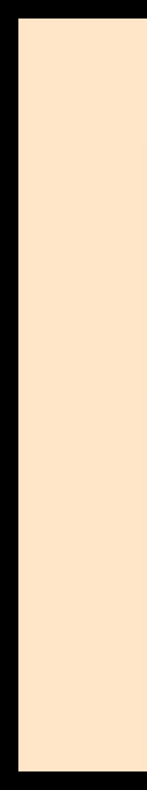
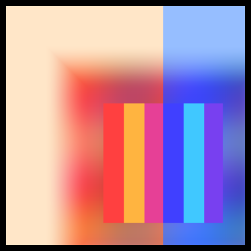
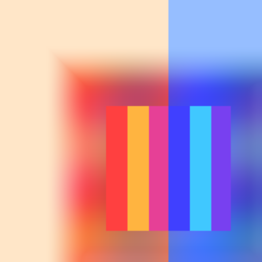
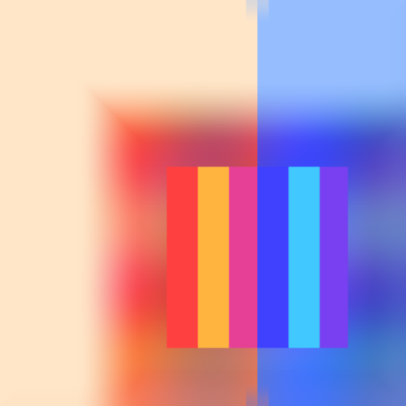
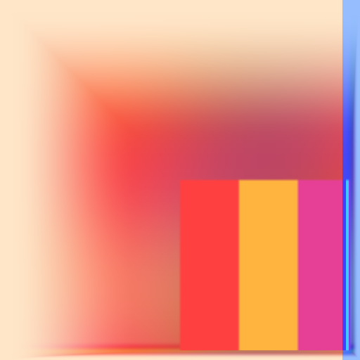
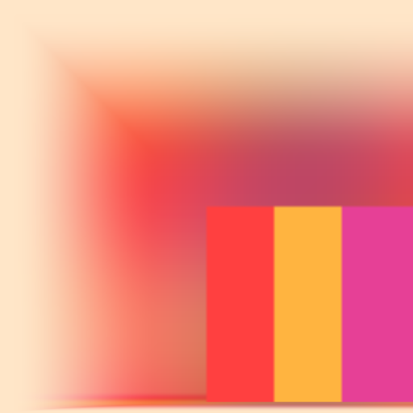
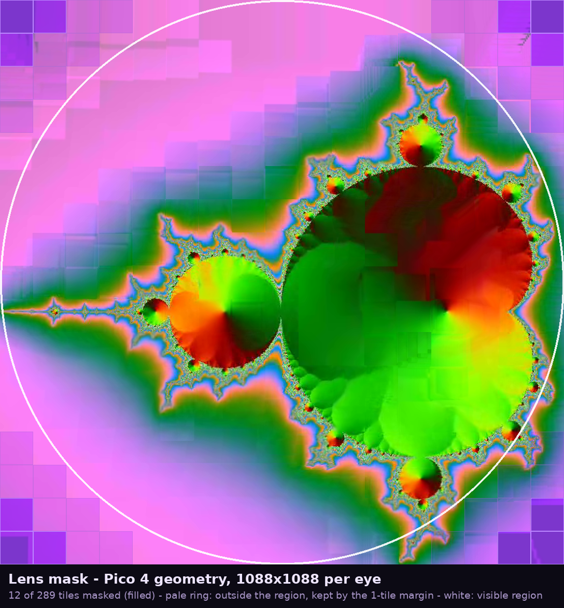
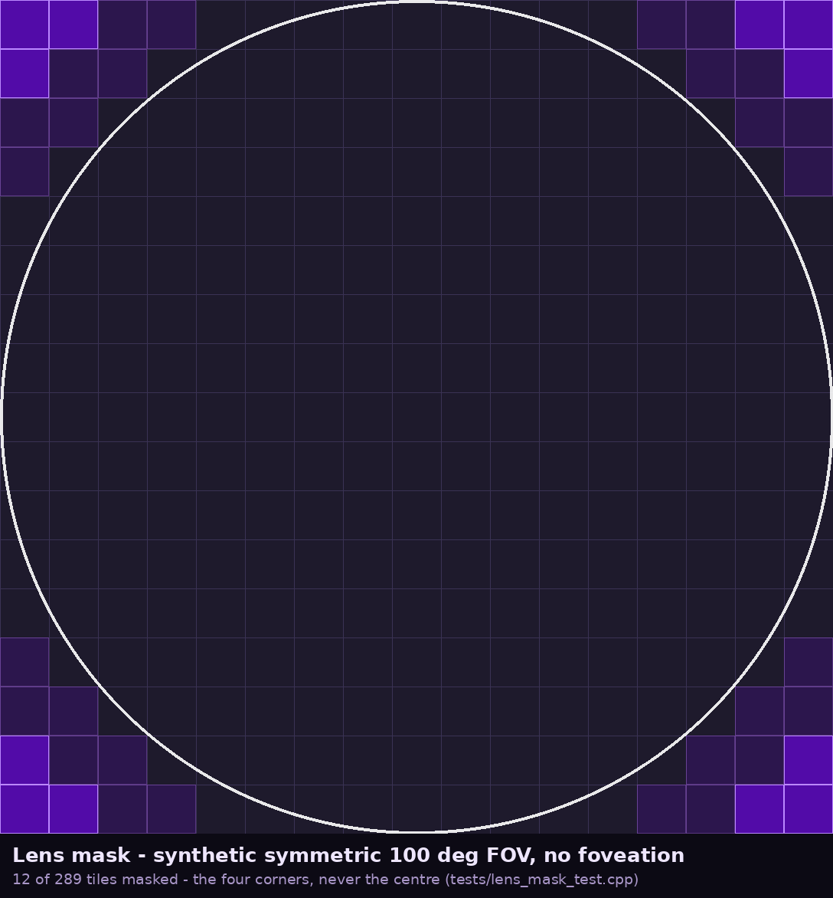

# Gallery

Pictures of things this fork does, for the cases where a description is worse than a look.

Everything here is generated by a test that can be re-run, and the command that made each
image is given beside it. Nothing is a screenshot of a headset: these are frames read back
off a GPU, so they are exact and they are reproducible.

---

## Edge bleed

The complaint: at a low frame rate, the black edges of the frame become visible when the
headset reprojects a late frame to the newest pose.

The headset's compositor takes the last frame it has and swings it to where your head is
now. Past the edge of that frame there is nothing to sample, and nothing is whatever the
layer was cleared to — black. A band of it sweeps in from the side of the view, wider the
later the frame and the faster the head, and because it is the one artefact that is not part
of the picture, it is the one the eye finds instantly.

`docs/NXWARP-E2E.md` section 6 has the mechanism and `docs/configuration.md` has the
`edge_bleed` keys. These are the pixels.

All of the frames below are the **real** `client/shaders/reprojection.glsl`, compiled at test
time and run on a headless Vulkan device by `tests/edge_bleed_test.cpp`, over a 256x256
synthetic picture rendered into a 512x512 layer **cleared to pure black**. So any black you
see is the artefact, not the content.

```sh
g++ -std=c++20 -O2 -I <vulkan headers> -o edge_bleed_test tests/edge_bleed_test.cpp -lvulkan -lz
./edge_bleed_test client/shaders/reprojection.glsl docs/assets
```

### The border, before and after

The left 96 columns of the layer, magnified 3x. This is the whole argument in three
pictures.

| before | clamp | fade |
| --- | --- | --- |
|  |  |  |

**before** is the situation being fixed: the layer is wider than the picture and nothing
fills the difference. The black band down the left edge is exactly what you see in the
headset — 24000 pixels of it in the border band, and the test asserts that it is there,
because a proof that nothing can be black is worth nothing if the arrangement could not
produce black in the first place.

**clamp** stretches the outermost row and column of the picture across the margin.

**fade** stretches, and then past a configurable distance decays into that edge's own
averaged colour, so a long stretch reads as the picture continuing off the side of the view
rather than as a streak.

In both, the band is gone: the darkest pixel anywhere in the frame is `(67, 72, 197)`.

### The whole layer

| before | clamp |
| --- | --- |
|  |  |

| fade | fade, margin 12 % |
| --- | --- |
|  |  |

All four carry the same large pose delta — a motion-smoothing warp of 15 % of the image
diagonally, far more than a frame of latency ever costs. The fourth uses a margin more than
twice the default, to show the guarantee is not an accident of the margin being narrow.

Note that these frames are the **fallback**, the half that invents its margin. With the
server's `edge_bleed.overscan` turned on instead, the margin is real decoded pixels and none
of this runs; that half costs resolution rather than inventing content, and the trade is
stated in `docs/configuration.md`.

### The eye split

Not a cosmetic case. When the NX Warp encoder codes both eyes as one stereo frame, the
decoded image holds the pair side by side and the shader normalises against the whole image.
Stretching this eye's edge outward against the *image* border therefore walks straight into
the eye beside it — a far worse artefact than the black it replaces, and one that would only
ever have appeared in a live stereo session.

The test picture's two halves carry disjoint colour ranges: the left is red-dominant
everywhere, the right blue-dominant everywhere. The left eye's ring is then rendered twice.

| clamped against the whole image | clamped against this eye |
| --- | --- |
|  |  |

The first is what the code did before `bleed_uv` was passed in: 12800 blue-dominant pixels,
the other eye smeared in from the right. The second is the fix: not one blue-dominant pixel
anywhere. Both legs are asserted, so the check is a before/after and not an unfalsifiable
"after".

---

## Lens mask — Pico 4 geometry, 1088x1088 per eye



**2026-09-06** · FOV 105° × 105° symmetric, no foveation · 1088x1088 encoded per eye, 17x17
tiles · **12 of 289 tiles masked per eye** at the default one-tile margin (40 at margin 0).

The background is a real decoded frame out of the NX Warp e2e harness, with the mask on:
the grey squares in the corners are the flattened tiles as the headset's decoder actually
reconstructed them. The overlay is drawn from the same `lens_tile_mask()` the server calls.
Filled purple is masked; the pale ring is the tiles that fall outside the visible region but
are kept coded by the margin; the white ellipse is `visible_region()`.

```sh
# the frame
ffmpeg -f lavfi -i "mandelbrot=size=1088x1088:rate=30" -t 2 -pix_fmt yuv420p -f rawvideo mandel.yuv
wivrn-nxwarp-e2e --yuv mandel.yuv --width 1088 --height 1088 --frames 40 \
    --inter on --qp 30 --deterministic --static-view --lens-mask on --decoded-out dec.yuv
ffmpeg -f rawvideo -pix_fmt yuv420p -s 1088x1088 -i dec.yuv -vf "select=eq(n\,30)" -vframes 1 dec30.png

# the overlay
g++ -std=c++23 -O2 -I. -o lens_mask_test tests/lens_mask_test.cpp
./lens_mask_test --dump 105 105 1088 1088 1088 1088 1     # the mask, as text
python3 tools/render_lens_mask.py ./lens_mask_test dec30.png
```

---

## Lens mask — synthetic symmetric 100° FOV



**2026-09-06** · FOV 100° × 100° symmetric, no foveation · 1088x1088, 17x17 tiles ·
**12 of 289 tiles masked per eye**.

The case `tests/lens_mask_test.cpp` asserts: the four corners are masked and the centre is
not, and nothing on the centre row or column is masked at any margin. A symmetric FOV gives
the same answer at every angle — the region is inscribed in the picture, so widening the FOV
scales both together — which is why the interesting axes are the foveation curve and the FOV's
asymmetry, not its size.

```sh
g++ -std=c++23 -O2 -I. -o lens_mask_test tests/lens_mask_test.cpp && ./lens_mask_test
python3 tools/render_lens_mask.py ./lens_mask_test dec30.png
```
