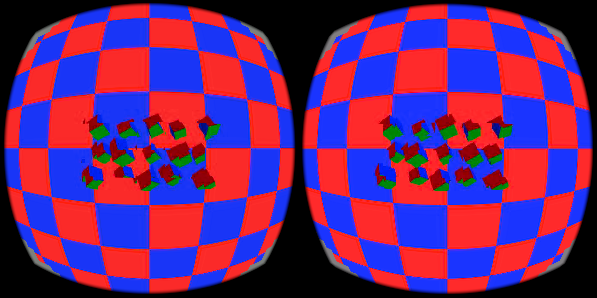

# Mutable UNORM atlas render alias (v2)

This three-arm Pico 4 capture tests the opt-in native-atlas render alias at
2160×2160 per eye and 90 Hz. The signed APK SHA-256 is
`a1a334fb9528a61f4d790cf7204f3c35d0c771aeae0f0f81a6bdda3d54e27027`.

| arm | median GPU window mean | estimated noncached median | encode→selection p99 |
|---|---:|---:|---:|
| on | 2.7 ms | 2.715 ms | 16.689 ms |
| off | 3.2 ms | 3.236 ms | 17.221 ms |
| repeat | 2.6 ms | 2.761 ms | 24.469 ms |

These are active-window means and the corresponding canonical selection tail;
the alias does not show a consistent end-to-end latency win. The captures use
the same native R8 atlas path, but remain short headset measurements with
runtime scheduling and scene variability. They establish no 240-Hz result.

The runtime fallback order is explicit: request the mutable sRGB/UNORM format
list with core mutable usage; if that request fails, retry with the same
mutable usage but no format-list extension structure. If that also fails,
remove mutable usage and create an ordinary sRGB swapchain. Create UNORM
attachment views only when mutable usage was accepted. The on and repeat logs record the format-list rejection
followed by successful mutable alias activation. The off log records the alias
as unavailable. Any unsupported usage, alias creation/view failure, fade, or
other non-neutral colour condition falls back to the ordinary sRGB render.

The alias removes the cancelling shader linearization and sRGB attachment
re-encoding only for neutral atlas scale/bias. Flat checker colours matched in
the v1/v2 check (`(25,53,247)` and `(251,42,41)`); this is a narrow colour
check, not broad scene or compositor colour proof. Screenshots are retained for
scene inspection, not motion-quality validation. See the copied measure logs,
render summaries, manifests, and 24-second screenshots in this directory.

The gzip timing CSVs retain the complete sessions and explicit wire-ID mappings.
The included latency parser uses a 10-second warmup and server-converted feedback
clocks; `blit` means render selection, not displayed photons. GPU rows are medians
of reported two-second means, not frame-level GPU percentiles.
